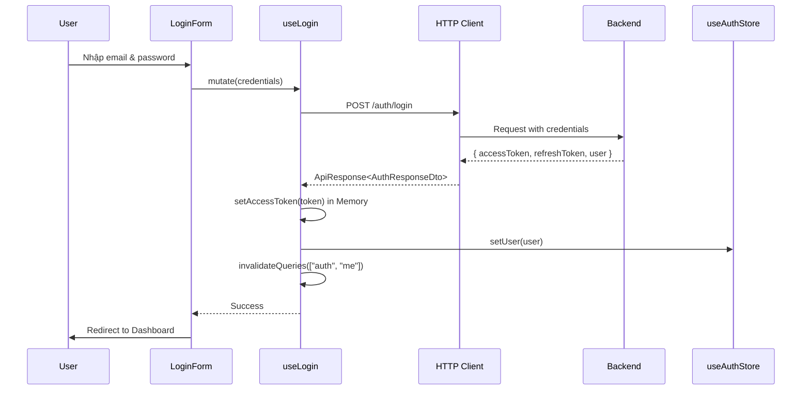
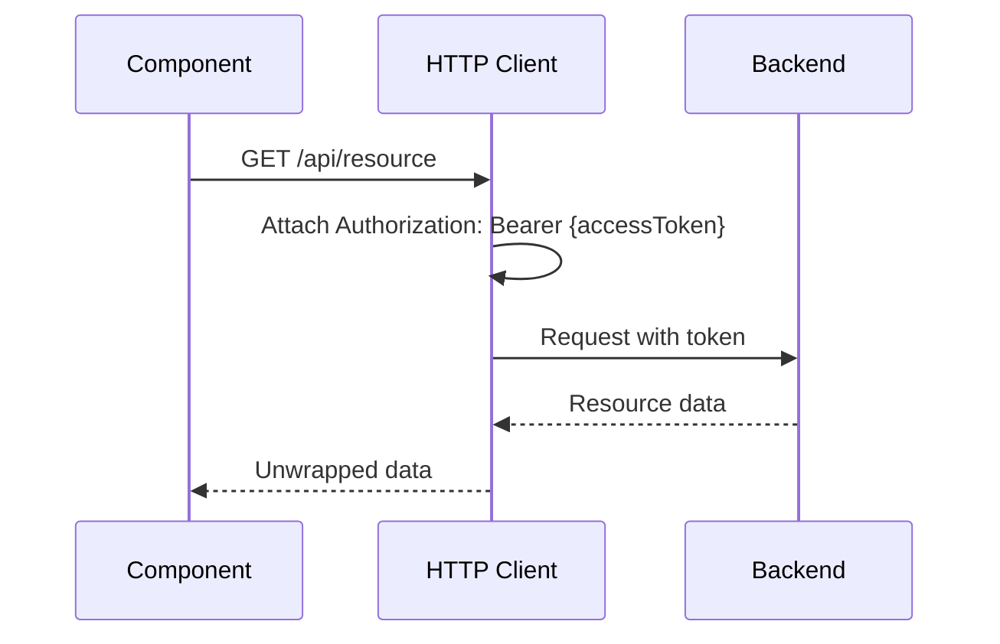
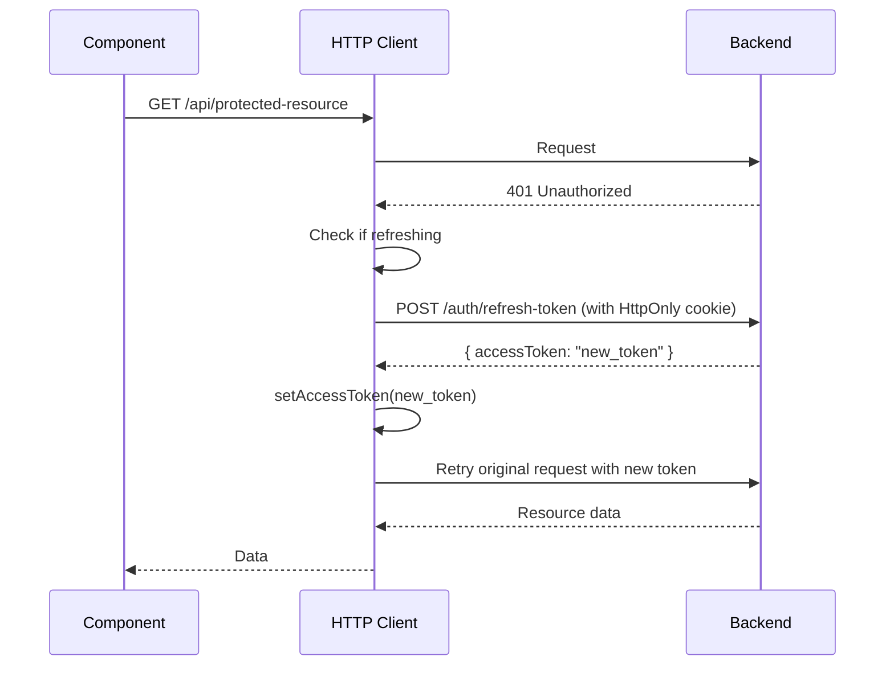

# Hotel Frontend - API Architecture & Authentication Flow

## 📋 Tổng quan

Tài liệu này mô tả chi tiết kiến trúc gọi API và luồng xác thực của dự án **Hotel Frontend** (bao gồm app `customer` và `hotel-owner`).

---

## 🏗️ Kiến trúc Monorepo

Project sử dụng **Turborepo** để quản lý monorepo với cấu trúc:

```
hotel_frontend/
├── apps/
│   ├── customer/          # Ứng dụng khách hàng
│   └── hotel-owner/       # Ứng dụng quản lý khách sạn
├── packages/
│   ├── api/              # HTTP client & API functions
│   ├── types/            # TypeScript type definitions
│   ├── store/            # Zustand state management
│   ├── ui/               # Shared UI components
│   └── lib/              # Shared utilities
```

---

## 🔐 Authentication Flow

### 1. Login Process



**Chi tiết:**
- Access Token được lưu trong **RAM** (biến `accessToken` trong `http.ts`)
- Refresh Token được Backend lưu trong **HttpOnly Cookie** (secure)
- User info được lưu vào **Zustand Store** và persist trong `localStorage`

### 2. Authenticated Requests



**Request Interceptor:**
```typescript
http.interceptors.request.use((config) => {
  if (accessToken) {
    config.headers.Authorization = `Bearer ${accessToken}`;
  }
  return config;
});
```

### 3. Refresh Token Mechanism



**Response Interceptor Logic:**
```typescript
http.interceptors.response.use(
  (response) => response.data, // Auto-unwrap
  async (error) => {
    if (error.response?.status === 401 && !originalRequest._retry) {
      // Queue requests while refreshing
      if (isRefreshing) {
        return new Promise((resolve) => {
          failedQueue.push({ resolve, reject });
        });
      }

      isRefreshing = true;
      
      // Call refresh endpoint (reads HttpOnly cookie)
      const res = await axios.post("/auth/refresh-token", 
        { refreshToken: "" }, 
        { withCredentials: true }
      );

      setAccessToken(res.data.data.accessToken);
      processQueue(null, newToken);
      
      // Retry original request
      return http(originalRequest);
    }
  }
);
```

---

## 📦 Core Packages

### 1. `@repo/api` - HTTP Client

**File:** `packages/api/src/http.ts`

**Chức năng:**
- Tạo Axios instance với base configuration
- Request/Response interceptors
- Token refresh mechanism
- Request queueing

**Export:**
```typescript
export const http: AxiosInstance;
export const setAccessToken: (token: string | null) => void;
export const getAccessToken: () => string | null;
export interface ApiResponse<T> { success, message, data, errors }
```

**Cấu hình:**
```typescript
export const http = axios.create({
  baseURL: process.env.NEXT_PUBLIC_API_URL || "/api",
  withCredentials: true,
  headers: { "Content-Type": "application/json" }
});
```

### 2. `@repo/types` - Type Definitions

**File:** `packages/types/src/auth.ts`

**DTOs chính:**
```typescript
export interface LoginDto {
  email: string;
  password: string;
}

export interface AuthResponseDto {
  accessToken: string;
  refreshToken: string;
  expiresAt: string;
  user?: UserDto;
}

export interface UserDto {
  id: string;
  email: string;
  firstName: string;
  lastName: string;
  role: UserRole;
  phoneNumber?: string;
}
```

### 3. `@repo/store` - State Management

**File:** `packages/store/src/auth.ts`

**Zustand Store với Persistence:**
```typescript
export const useAuthStore = create<AuthState>()(
  persist(
    (set) => ({
      token: null,
      user: null,
      setToken: (token) => set({ token }),
      setUser: (user) => set({ user }),
      logout: () => set({ token: null, user: null }),
      clearAuth: () => set({ token: null, user: null }),
    }),
    {
      name: "hotel-auth-storage",
      storage: createJSONStorage(() => localStorage),
      partialize: (state) => ({ user: state.user }), // CHỈ lưu user
    }
  )
);
```

**⚠️ Security Note:**
- **Access Token**: Lưu trong RAM (biến `accessToken` trong `http.ts`)
- **Refresh Token**: Lưu trong HttpOnly Cookie (do Backend quản lý)
- **User Info**: Persist trong `localStorage` (không nhạy cảm)

---

## 🎣 React Query Integration

### QueryClientProvider Setup

**File:** `apps/*/src/app/providers.tsx`

```typescript
const [queryClient] = useState(() => new QueryClient({
  defaultOptions: {
    queries: {
      retry: 1, // Retry 1 lần nếu lỗi
      staleTime: 60 * 1000, // Cache 1 phút
      refetchOnWindowFocus: false,
    },
  },
}));

return (
  <QueryClientProvider client={queryClient}>
    <AuthInitializer />
    {children}
  </QueryClientProvider>
);
```

### Custom Hooks

#### `useLogin` Hook

**File:** `apps/*/src/features/auth/hooks/useLogin.ts`

```typescript
export const useLogin = () => {
  const queryClient = useQueryClient();
  const { setUser } = useAuthStore();

  const mutation = useMutation({
    mutationFn: (data: LoginDto) => login(data),
    onSuccess: (response) => {
      if (response?.success && response.data) {
        // 1. Lưu Access Token vào Memory
        setAccessToken(response.data.accessToken);
        
        // 2. Cập nhật Store
        if (response.data.user) {
          setUser(response.data.user);
        }
        
        // 3. Invalidate để refetch user profile
        queryClient.invalidateQueries({ queryKey: ["auth", "me"] });
      }
    },
    onError: (error) => {
      console.error("Login failed:", error);
    }
  });

  return {
    mutate: mutation.mutate,
    isPending: mutation.isPending,
    error: mutation.error,
  };
};
```

#### `useAuth` Hook

**File:** `apps/*/src/features/auth/hooks/useAuth.ts`

```typescript
export const useAuth = () => {
  const { setUser, clearAuth } = useAuthStore();

  const { data, isLoading, isError, refetch } = useQuery({
    queryKey: ["auth", "me"],
    queryFn: async () => {
      const res = await getProfile();
      return res;
    },
    retry: (failureCount, error: any) => {
      if (error?.response?.status === 401) return false;
      return failureCount < 1;
    },
    staleTime: 5 * 60 * 1000,
    refetchOnWindowFocus: true,
  });

  useEffect(() => {
    if (data?.success && data.data) {
      setUser(data.data);
    } else if (isError) {
      clearAuth();
    }
  }, [data, isError, setUser, clearAuth]);

  return {
    user: data?.data ?? null,
    isAuthenticated: !!data?.data,
    isLoading,
    isError,
    refetch,
  };
};
```

#### `useLogout` Hook

**File:** `apps/*/src/features/auth/hooks/useLogout.ts`

```typescript
export const useLogout = () => {
  const queryClient = useQueryClient();
  const router = useRouter();
  const { logout: clearStore } = useAuthStore();

  return useMutation({
    mutationFn: logout,
    onSuccess: () => {
      setAccessToken(null);
      clearStore();
      queryClient.clear();
      router.push("/login");
    },
  });
};
```

---

## 🛡️ AuthInitializer Component

**File:** `apps/*/src/features/auth/components/AuthInitializer.tsx`

**Mục đích:** Tự động kiểm tra session khi app load và redirect nếu hết hạn

```typescript
export default function AuthInitializer() {
  const { isError, isLoading } = useAuth();
  const router = useRouter();
  const pathname = usePathname();
  const { showNotification } = useNotification();

  useEffect(() => {
    const PUBLIC_PATHS = ["/login", "/register", "/forgot-password"];
    
    if (PUBLIC_PATHS.some(path => pathname.startsWith(path))) {
      return; // Không check nếu đang ở trang public
    }

    if (isError && !isLoading) {
      showNotification({
        message: "Phiên đăng nhập đã hết hạn. Vui lòng đăng nhập lại.",
        type: "error",
      });
      router.replace("/login");
    }
  }, [isError, isLoading, pathname]);

  return null;
}
```

**Cách hoạt động:**
1. `useAuth()` tự động gọi `getProfile()` khi app mount
2. Nếu Access Token hết hạn → 401 → Interceptor tự động refresh
3. Nếu Refresh Token cũng hết hạn → `isError = true` → Redirect về Login

---

## 🔄 Complete Authentication Flow Diagram

```
┌─────────────────────────────────────────────────────────────────┐
│                       APP INITIALIZATION                         │
├─────────────────────────────────────────────────────────────────┤
│  1. AuthInitializer renders                                     │
│  2. useAuth() hook triggered                                    │
│  3. React Query calls getProfile()                              │
│  4. HTTP Client checks for accessToken in memory               │
│     ├─ If exists → Add to Authorization header                 │
│     └─ If not exists → Request without token                   │
│  5. Backend validates token                                     │
│     ├─ Valid → Return user data                                │
│     └─ Invalid (401) → Trigger Refresh Flow                    │
└─────────────────────────────────────────────────────────────────┘

┌─────────────────────────────────────────────────────────────────┐
│                      REFRESH TOKEN FLOW                          │
├─────────────────────────────────────────────────────────────────┤
│  1. Interceptor catches 401 error                               │
│  2. Check if already refreshing                                 │
│     ├─ Yes → Queue request                                     │
│     └─ No → Start refresh process                              │
│  3. POST /auth/refresh-token (withCredentials: true)           │
│  4. Backend reads HttpOnly cookie                               │
│  5. Backend validates refresh token                             │
│     ├─ Valid → Return new accessToken                          │
│     │   ├─ Save to memory: setAccessToken(newToken)           │
│     │   ├─ Process queued requests                             │
│     │   └─ Retry original request                              │
│     └─ Invalid → Clear session & redirect to login             │
└─────────────────────────────────────────────────────────────────┘

┌─────────────────────────────────────────────────────────────────┐
│                         LOGIN FLOW                               │
├─────────────────────────────────────────────────────────────────┤
│  1. User enters credentials                                     │
│  2. useLogin().mutate({ email, password })                     │
│  3. POST /auth/login                                            │
│  4. Backend returns:                                            │
│     ├─ accessToken (in JSON body)                              │
│     ├─ refreshToken (in HttpOnly Cookie)                       │
│     └─ user info (in JSON body)                                │
│  5. Frontend:                                                   │
│     ├─ setAccessToken(token) → RAM                             │
│     ├─ setUser(user) → Zustand Store → localStorage           │
│     └─ invalidateQueries(["auth", "me"])                      │
│  6. Redirect to dashboard                                       │
└─────────────────────────────────────────────────────────────────┘

┌─────────────────────────────────────────────────────────────────┐
│                        LOGOUT FLOW                               │
├─────────────────────────────────────────────────────────────────┤
│  1. User clicks logout                                          │
│  2. useLogout().mutate()                                       │
│  3. POST /auth/logout                                           │
│  4. Backend:                                                    │
│     ├─ Invalidate refresh token in database                    │
│     └─ Clear HttpOnly cookie                                   │
│  5. Frontend:                                                   │
│     ├─ setAccessToken(null) → Clear RAM                        │
│     ├─ clearAuth() → Clear Zustand Store → Clear localStorage │
│     ├─ queryClient.clear() → Clear React Query cache          │
│     └─ router.push("/login")                                   │
└─────────────────────────────────────────────────────────────────┘
```

---

## 🗂️ Folder Structure

### Customer App
```
apps/customer/src/
├── app/
│   ├── (public)/
│   │   └── login/
│   │       └── LoginPageContent.tsx    # UI trang login
│   ├── (protected)/                     # Routes cần auth
│   ├── providers.tsx                    # QueryClientProvider
│   └── layout.tsx
└── features/
    └── auth/
        ├── api.ts                       # API functions: login, getProfile, logout
        ├── components/
        │   └── AuthInitializer.tsx      # Session checker
        └── hooks/
            ├── useLogin.ts              # Login mutation
            ├── useAuth.ts               # Get current user
            └── useLogout.ts             # Logout mutation
```

### Hotel Owner App
```
apps/hotel-owner/src/
├── app/
│   ├── (public)/
│   │   └── login/
│   │       └── LoginPageContent.tsx
│   ├── (protected)/
│   │   └── (normal)/
│   │       └── layout.tsx               # Dashboard layout (có sidebar)
│   ├── providers.tsx
│   └── layout.tsx
└── features/
    └── auth/
        ├── api.ts
        ├── components/
        │   └── AuthInitializer.tsx
        └── hooks/
            ├── useLogin.ts
            ├── useAuth.ts
            └── useLogout.ts
```

---

## 🚀 Usage Examples

### 1. Login trong Component

```typescript
"use client";

import { useLogin } from "@/features/auth/hooks/useLogin";
import { useRouter } from "next/navigation";

export default function LoginPage() {
  const { mutate, isPending } = useLogin();
  const router = useRouter();

  const handleSubmit = (data: LoginDto) => {
    mutate(data, {
      onSuccess: () => {
        router.push("/dashboard");
      },
      onError: (error) => {
        console.error("Login failed:", error);
      }
    });
  };

  return (
    <LoginForm
      onSuccess={handleSubmit}
      isLoading={isPending}
    />
  );
}
```

### 2. Kiểm tra Authentication

```typescript
import { useAuth } from "@/features/auth/hooks/useAuth";

export default function DashboardPage() {
  const { user, isAuthenticated, isLoading } = useAuth();

  if (isLoading) return <LoadingSpinner />;
  if (!isAuthenticated) return <Navigate to="/login" />;

  return (
    <div>
      <h1>Welcome, {user?.firstName}!</h1>
    </div>
  );
}
```

### 3. Gọi Protected API

```typescript
import { http } from "@repo/api";

export const getBookings = async () => {
  // Token tự động được attach bởi interceptor
  const res = await http.get<ApiResponse<Booking[]>>("/bookings");
  return res; // Đã được unwrap bởi response interceptor
};

// Sử dụng với React Query
const { data } = useQuery({
  queryKey: ["bookings"],
  queryFn: getBookings,
});
```

### 4. Logout

```typescript
import { useLogout } from "@/features/auth/hooks/useLogout";

export default function ProfileMenu() {
  const { mutate: logout } = useLogout();

  return (
    <button onClick={() => logout()}>
      Đăng xuất
    </button>
  );
}
```

---

## 🔒 Security Best Practices

### ✅ Đã Triển Khai

1. **Access Token trong Memory**: Không lưu vào `localStorage` → Chống XSS
2. **Refresh Token trong HttpOnly Cookie**: JavaScript không thể đọc → Chống XSS
3. **Automatic Token Refresh**: Transparent đối với user
4. **Request Queueing**: Tránh multiple refresh requests
5. **HTTPS Only**: Cookie có flag `Secure`
6. **SameSite Cookie**: Chống CSRF attacks

### ⚠️ Lưu Ý Backend

Backend cần implement:
```csharp
// Login Endpoint
Response.Cookies.Append("refresh_token", refreshToken, new CookieOptions
{
    HttpOnly = true,
    Secure = true,
    SameSite = SameSiteMode.None,
    Expires = DateTimeOffset.UtcNow.AddDays(7)
});

// Refresh Token Endpoint
var refreshToken = Request.Cookies["refresh_token"] ?? dto.RefreshToken;
// Ưu tiên đọc từ Cookie trước
```

---

## 🐛 Troubleshooting

### Issue: "401 Unauthorized" vòng lặp vô hạn

**Nguyên nhân:** Refresh token endpoint cũng trả về 401

**Giải pháp:**
```typescript
// http.ts - Response Interceptor
if (originalRequest.url?.includes("/auth/refresh")) {
  return Promise.reject(error); // Không retry refresh endpoint
}
```

### Issue: Token không được gửi trong request

**Nguyên nhân:** `accessToken` chưa được set

**Kiểm tra:**
```typescript
import { getAccessToken } from "@repo/api";
console.log("Current token:", getAccessToken());
```

### Issue: Cookie không được gửi

**Nguyên nhân:** Thiếu `withCredentials: true`

**Giải pháp:**
```typescript
axios.post("/auth/refresh-token", data, {
  withCredentials: true // QUAN TRỌNG!
});
```

---

## 📚 Tech Stack Summary

| Layer | Technology | Purpose |
|-------|-----------|---------|
| **Monorepo** | Turborepo | Workspace management |
| **Framework** | Next.js 14 (App Router) | React framework |
| **HTTP Client** | Axios | API calls & interceptors |
| **State Management** | Zustand + Persistence | Global auth state |
| **Data Fetching** | React Query (TanStack) | Server state & caching |
| **Type Safety** | TypeScript | Type definitions |
| **Forms** | React Hook Form + Zod | Form validation |
| **UI Components** | Shared `@repo/ui` | Reusable components |

---

## 🎯 Key Takeaways

1. **Access Token = Memory Only** (biến trong `http.ts`)
2. **Refresh Token = HttpOnly Cookie** (Backend quản lý)
3. **User Info = Zustand + localStorage** (không nhạy cảm)
4. **Automatic Refresh** = Transparent UX
5. **AuthInitializer** = Session guard cho toàn app
6. **React Query** = Server state + caching

---

## 📝 Notes for Backend Team

Frontend mong đợi Backend endpoints:

```
POST /auth/login
- Body: { email, password }
- Response: { success, message, data: { accessToken, refreshToken?, user } }
- Cookie: Set refresh_token (HttpOnly, Secure, SameSite=None)

POST /auth/refresh-token
- Body: { refreshToken?: "" } (optional, ưu tiên đọc từ cookie)
- Cookie: Read refresh_token
- Response: { success, message, data: { accessToken } }
- Cookie: Update refresh_token với token mới

GET /users/profile
- Headers: Authorization: Bearer {accessToken}
- Response: { success, message, data: UserDto }

POST /auth/logout
- Headers: Authorization: Bearer {accessToken}
- Cookie: Clear refresh_token
- Response: { success, message }
```

---

**Last Updated:** 2026-01-16  
**Version:** 1.0.0  
**Author:** Hotel Frontend Team
